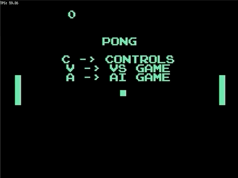

# Pong in Go

This is a pet project to try out WebAssembly with Go (golang) in a fun way. The game should be available [on my blog](https://dstoiko.github.io/posts/go-pong-wasm/). You can also build it and try locally on desktop.

_The AI always wins..._

## Features

- [x] Works on desktop (Linux, MacOS, Windows)
- [x] Works in web browsers using WebAssembly
- [x] 2-player "VS" mode with same keyboard
- [x] Survival-style "AI" mode with unbeatable AI (unless you find a glitch)
- [x] Difficulty/speed increases as you play

## Build locally

First, `git clone` and `cd` into this repo.

### Native desktop version

1. Run `make native` to build for native desktop (Linux, MacOS, Windows)
2. Run the game binary: `./build/pong`

### WebAssembly version (browser)

1. Run `make wasm` to build for WASM target
2. Run the simple web server locally: `go run server/server.go`
3. Run the game inside a browser at https://localhost:8080

## TODO / Ideas

- [ ] Make it work on mobile (gomobile compilation targets + touch/drag handling of paddles)
- [ ] Add sounds from original Pong game
- [ ] Add crazy mode with multiple balls
- [ ] Add leaderboard
